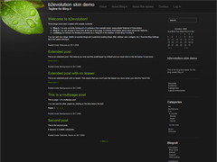
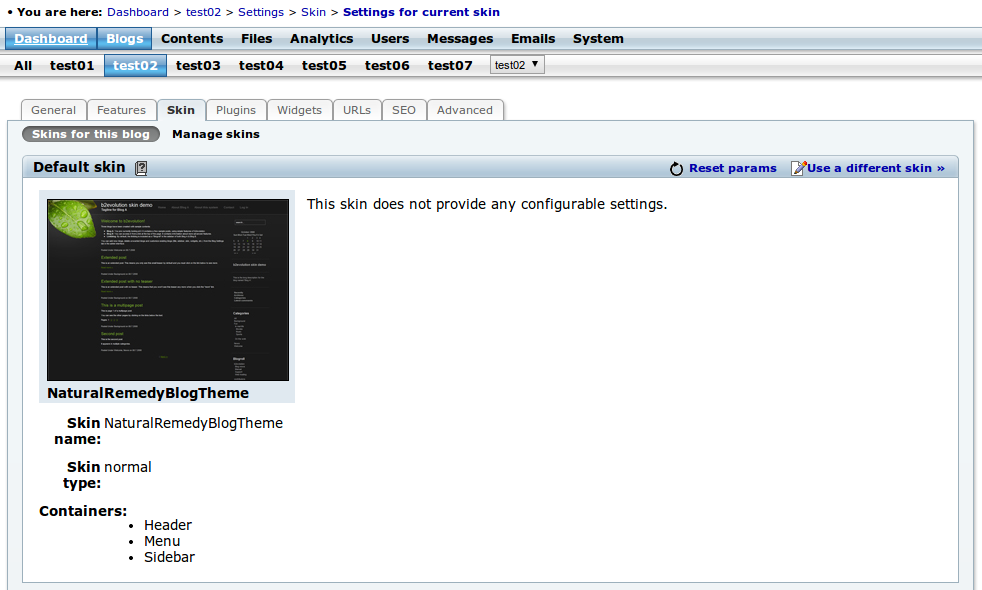
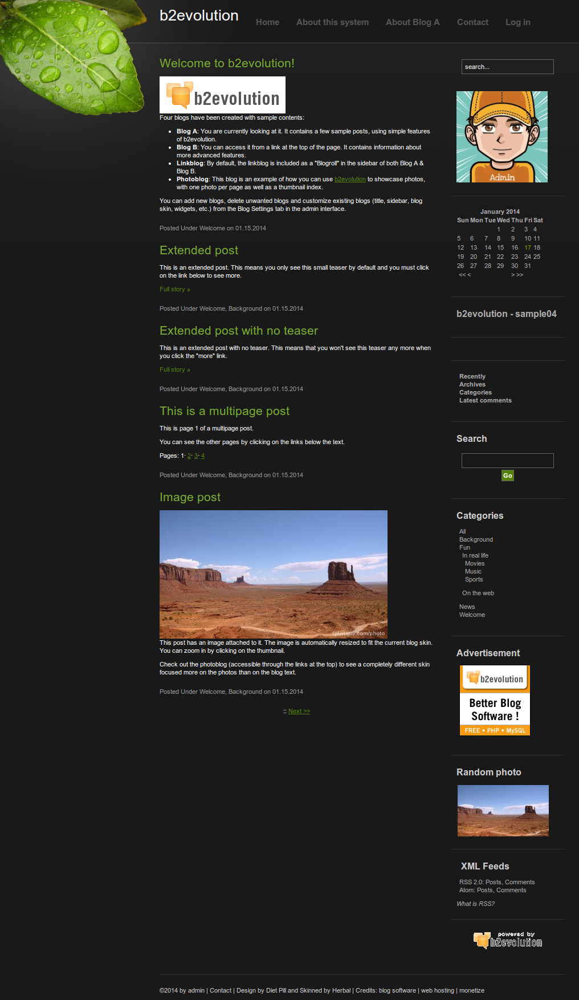
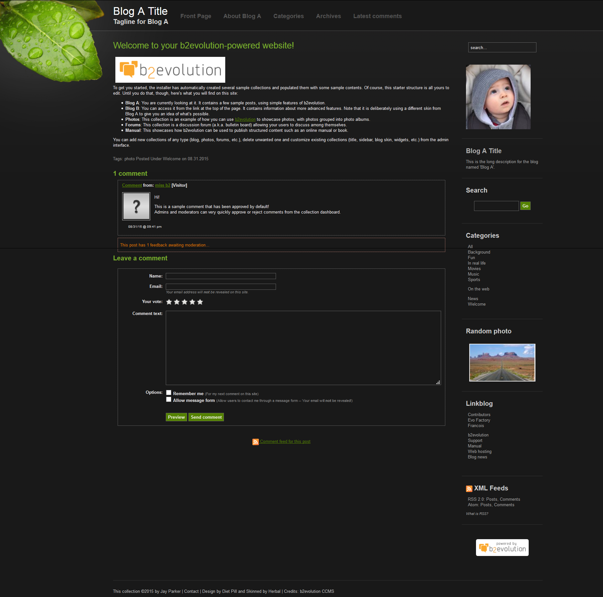

# Natural Remedy Skin
Natural Remedy v1.2 skin for b2evolution CMS.

### Update Log

#### Version: 1.2.1

- Correct skin version fix

#### Version: 1.2

- Sitewide_header included for easier multibloging experience

 
This skin has been developed by a third party. It has been updated by the b2evolution group in an effort to make it work with the latest version of b2evolution. However, this skin is not officially supported by the b2evolution group.
